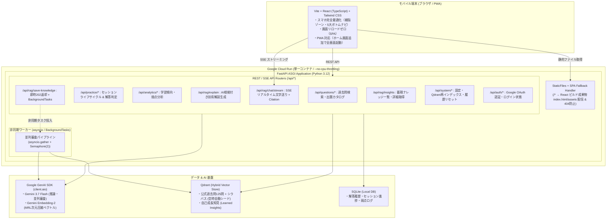

# IPA Exam RAG システム刷新基本設計書 (Redesign Blueprint)

本ドキュメントは、IPA Exam RAG（情報処理技術者試験 RAG システム）の PoC 運用で得られた知見に基づき、**「アーキテクチャ破壊的刷新を含む 15 大完了定義（DoD）」**、**「非同期・モバイルファースト実装方針」**、および**「Why-First に基づく全 15 本の Issue 詳細要件仕様（ロードマップ）」**を体系的に定義する設計基本文書です。

小手先のパッチワークや場当たり的なコード追加を根絶し、本質的なユーザー価値と堅牢なシステム基盤を両立させるための仕様正本（SSOT）として位置づけます。

---

## 1. 背景と課題意識 (Why)

### 1.1. システムの本来の存在意義
本システムは、**「IPA（高度情報処理技術者・システムアーキテクト等）の過去問・シラバス・公式解説をナレッジベースとし、ユーザーとの対話を通じて自律的に知見を獲得・成長し続ける高精度な RAG システム」** をコアドメイン（主役）とします。
過去問道場機能は、その RAG の真価を最大限に引き出し、学習者が最も快適に知識を吸収・フィードバックするための**インターフェース（タッチポイント）**です。

### 1.2. PoC（Streamlit）で露呈した構造的限界
初期プロトタイプ（PoC）としての Streamlit 運用を通じ、以下の致命的なボトルネックが明らかになりました：

1. **画面全体リロード（Rerun）モデルの限界**:
   操作ごとにスクリプト全体が再実行されるため、画面の一部だけを滑らかに更新するモダンな非同期処理が原理的に困難。
2. **完全同期処理による画面フリーズ**:
   LLM・Embedding・Qdrant の呼び出しがすべて直列同期で実行され、知見保存時に 15〜25 秒間画面が完全停止する。
3. **RAG 検索の不透明性（ブラックボックス）**:
   AI がどのナレッジ（過去問・蓄積知見）を参照したのかが UI に一切表示されず、ユーザーから「本当に RAG が機能しているのか？」が検証できない。
4. **モバイル（スマホ）体験の破綻**:
   PC 大画面向けの 2 カラムレイアウト、固定高さ 350px の窮屈なチャット枠、注意書き用青ボックス（`st.info`）の流用、親指で押しづらい長大なボタンなど、スマホでの学習に耐えうる設計になっていない。
5. **不自然な用語**:
   「AI チューター」という日常会話として不自然なカタカナ語が残存している。

これらを小手先で修正することは、コードのつぎはぎ（パッチワーク）を招き、根本的解決になりません。痛みを伴う変更を受け入れ、**「非同期 API（FastAPI） ＋ モバイル Web SPA（Vite/React）」** への完全リプレイス（破壊的刷新）を行います。

---

## 2. 達成すべき 15 大完了定義 (Definition of Done: DoD)

本刷新プロジェクトにおいて達成すべきゴールは、以下の **3 つの柱（全 15 項目）** に体系化されます。各 DoD は後述する全体 Issue 計画（ISSUE-012 〜 026）と **完全に 1 対 1** で対応し、客観的に検証可能です。

### 【柱 1: バックエンド API & 非同期基盤 DoD】 (7 項目)

| # | 完了定義 (DoD) | 現状の課題 | 達成基準（客観的完了条件） |
| :--- | :--- | :--- | :--- |
| **DoD-B1** | **FastAPI 基盤 & 過去問カタログ API の確立** | Streamlit 密結合で API が存在せず、起動時マイグレーションや DI 基盤がない | ・FastAPI アプリ初期化、CORS、起動時 SQLite マイグレーション自動実行が動作すること ・`GET /api/questions`（一覧・年度/分野/キーワード検索・単一詳細）が提供され、Swagger/pytest で PASS すること ・**`/api/*` 以外の未定義パスに対する SPA HTML5 History API Fallback（`dist/index.html` へのルーティング基盤）が整備され、ブラウザ直接アクセスやリロードで 404 が発生しないこと** |
| **DoD-B2** | **道場セッション & 解答判定・履歴永続化 API の確立** | 演習のセッション進行や中断・再開、解答記録が API 化されていない | ・`POST /api/practice/sessions`（作成・中断取得・再開・進捗保存・完了・破棄）が動作すること ・`POST /api/practice/submit` で解答判定と SQLite `practice_attempts` への永続化が動作すること |
| **DoD-B3** | **学習傾向・弱点分析ダッシュボード API の確立** | 蓄積された解答ログを集計・分析して返却する API が存在しない | ・`GET /api/analytics/*`（サマリー、分野別正答率・苦手アラート、要復習ランキング、解答履歴ログ）が正確な集計データを返却すること |
| **DoD-B4** | **RAG 非同期検索 & AI 根拠解説 API の確立** | Qdrant 空時の自動投入がなく、解答後の公式根拠解説生成が同期処理 | ・起動時に Qdrant のデータ存在を確認し、空なら初期シード 125 問を自動投入すること ・`POST /api/rag/explain` で、Qdrant 検索に基づく根拠付き技術解説が非同期生成されること |
| **DoD-B5** | **AI 対話 SSE ストリーミング & Citation メタデータ API の確立** | 対話回答が全文待機の一括返却で遅く、参照したナレッジ情報が送信されない | ・`POST /api/rag/chat/stream` において、SSE により **0.5秒未満** でリアルタイム文字送りが開始されること ・ストリーム冒頭で参照したナレッジ（Citation）メタデータが JSON 送信され、API 切断/エラー時には `event: error` が安全に送出されること |
| **DoD-B6** | **RAG 自己成長・並列審査 & バックグラウンド保存 API の確立** | 知見審査が直列実行で 15〜25 秒かかり、保存時に画面がブロックされる | ・`asyncio.gather` ＋ `Semaphore(2)` で知見候補の審査を一括並列実行すること ・FastAPI `BackgroundTasks` により、**0.1秒以内** に HTTP 202（受付完了）を返し、裏で安全に Qdrant 登録が完走すること |
| **DoD-B7** | **システム設定 & Google OAuth 認証 API の確立** | APIキー更新や再インデックス、Cloud Run での特定アカウント限定認証が API 化されていない | ・`/api/system/*`（APIキー更新、Qdrant全問再インデックス、履歴リセット）が動作すること ・`/api/auth/*`（Google OAuth ログイン・ユーザー情報取得・ログアウト）が動作すること |

---

### 【柱 2: モバイル特化 フロントエンド SPA DoD】 (7 項目)

| # | 完了定義 (DoD) | 現状の課題 | 達成基準（客観的完了条件） |
| :--- | :--- | :--- | :--- |
| **DoD-F1** | **Vite/React モバイル共通基盤 & 5 大ボトムナビの確立** | 画面全体リロードが発生し、スマホ向けボトムナビゲーションが存在しない | ・Vite + React + Tailwind CSS + PWA による独立 SPA が構築されていること（※PWA はホーム画面追加による全画面起動＋UI静的アセットキャッシュにスコープを限定） ・5 大ボトムナビ（道場、検索、AI質問、ノート、分析）＋ 設定アイコンで画面遷移が滑らかに行えること |
| **DoD-F2** | **🥋 過去問道場 演習画面の実装 (青ボックス全廃・親指操作・AI質問連携)** | 問題文が注意書き用青ボックス（`st.info`）で表示され、ボタンが押しにくく、AI質問への文脈連携がない | ・青ボックスを完全廃止し、スレートダーク調（`#1E293B`）の読解専用問題カードが表示されること ・大きな4択選択カード（48px以上タップ領域）で即時解答判定と公式解説が表示されること ・出題設定および中断セッション再開モーダルが片手親指で操作完結すること ・**解答判定後の解説エリアに「💡 この問題を AI に質問する」ボタンが配置され、設問文脈（ID・本文・選択肢）を引き継いで AI 質問画面へワンタップ遷移できること** |
| **DoD-F3** | **📖 過去問ブラウズ & 検索画面の実装 (125問自由閲覧)** | 演習を挟まずに全問を自由に検索・閲覧する機能がフロントエンドに存在しない | ・全 125 問を年度・分野・キーワードで検索・一覧閲覧できること ・設問カードからワンタップで「この問題を AI に質問する」画面へシームレスに遷移できること |
| **DoD-F4** | **💡 AI に質問画面の実装 (ストリーミング・Citation・保存トースト完結)** | 350px の窮屈な枠に閉じ込められ、文字送りがなく、参照元が見えず、保存ボタンが別画面に分断されていた | ・固定高さ 350px を撤廃し、下部固定チャットバーから質問できること ・**0.5秒未満** でリアルタイム文字送りが描画されること ・回答直下に「📚 参照したナレッジ（Citation）」カードが自動展開されること ・**「💡 ナレッジに保存」ボタンを押した瞬間にトースト通知が表示され、1ミリ秒も画面を止めずに保存が完結すること** |
| **DoD-F5** | **📚 マイ知見ノート画面の実装 (蓄積ナレッジ一覧・詳細展開)** | 保存した知見がどこにあるか分からず、開発者用語（監査）になっていた | ・ボトムナビから「📚 マイ知見ノート」をワンタップで開けること ・Qdrant に蓄積された自己成長知見カードの一覧、タグ検索、詳細（核心概念・トラップ・実務指針）が閲覧できること |
| **DoD-F6** | **📊 学習傾向・弱点分析画面の実装 (習熟度バー・履歴ログ)** | 履歴データが表面的で、スマホで直感的に苦手分野を把握しづらい | ・全体サマリー（正答率、総解答数）、分野別習熟度プログレスバー、苦手分野アラートが表示されること ・要復習問題ランキングおよび直近の解答履歴ログが美しいモバイルカード形式で可視化されること |
| **DoD-F7** | **⚙️ システム設定モーダル & ログイン管理の実装** | スマホ画面から API キー設定や Qdrant 再インデックス、ログイン状態確認が行えない | ・ヘッダーの ⚙️ アイコンから設定モーダルを開き、APIキー変更、Qdrant接続確認、全問再インデックスが実行できること ・Google アカウントでのログイン状態表示・ログアウトが行えること |

---

### 【柱 3: システム統合 & Streamlit 完全撤廃 DoD】 (1 項目)

| # | 完了定義 (DoD) | 現状の課題 | 達成基準（客観的完了条件） |
| :--- | :--- | :--- | :--- |
| **DoD-I1** | **Multi-stage Docker 統合 & Streamlit 完全撤廃** | 2重サーバー管理の懸念、Cloud Run での裏処理凍結リスク、旧コードの残存 | ・Multi-stage Dockerfile により、React 静的成果物が FastAPI から同一オリジン配信（SPA History API Fallback 完備）され、単一コンテナで稼働すること ・Cloud Run `--no-cpu-throttling`（CPU常時割当）が設定され、裏処理凍結が物理排除されること ・**旧 Streamlit コード（`src/presentation/app.py`）および依存関係がプロジェクトから完全削除され、全 14 画面・API が本番環境で総合結合 PASS すること** |

---

## 3. 技術選定とアーキテクチャ設計 (How)

### 3.1. 全体アーキテクチャ図

---

### 3.2. バックエンド設計方針 (FastAPI)

1. **完全非同期（ASGI）基盤 & SPA ルーティング**:
   - `FastAPI` ＋ `Uvicorn` を採用。
   - `src/domain/` の Pydantic モデルをそのまま API スキーマとして再利用し、型安全な入出力を保証。
   - アプリ起動時の Lifespan で、SQLite の自動マイグレーション実行および Qdrant のデータ存在確認（空の場合は初期シード 125 問を自動投入）を保証。
   - **SPA HTML5 History API Fallback**: `/api/*` 以外の未定義リクエストに対し常に `dist/index.html` を返却するハンドラー（または Catch-all ルート）を整備し、ブラウザ直接アクセスやリロード時の 404 を物理防止。
2. **ストリーミング通信 (SSE)**:
   - `/api/rag/chat/stream` において、`StreamingResponse(content, media_type="text/event-stream")` を使用。
   - 最初のイベントで Qdrant の検索結果（`event: citation`）を送信し、後続イベントで Gemini の生成トークン（`event: token`）を順次ストリーム配信。
   - ストリーム切断やクォータ超過等の異常時は `event: error` を送出して安全に通信を終了。
3. **安全なバックグラウンドタスク (BackgroundTasks)**:
   - `/api/rag/save-knowledge` はリクエスト直後に HTTP 202 Accepted を返却。
   - 抽出された知見候補に対し、`asyncio.gather` で並列審査（Judge Agent）を実行。Gemini レート制限防止のため `asyncio.Semaphore(2)` で同時並列数を制御。
4. **システム管理 ＆ 認証エンドポイント**:
   - `/api/system/settings` による API キー更新や Qdrant 再インデックス。
   - `/api/auth/*` による Google OAuth 2.0 ログイン・コールバック・ログアウトハンドリング。

---

### 3.3. フロントエンド設計方針 (Vite + React + Tailwind CSS)

1. **モバイルファースト・共通レイアウト基盤**:
   - 5 大ボトムナビゲーションバー（🥋道場、📖検索、💡AI質問、📚マイノート、📊分析）＋ ヘッダー設定アイコン（⚙️）。
   - 型安全な API クライアント（共通 fetch ラッパー、エラーハンドリング）。
   - ※ PWA 対応はホーム画面追加による全画面スタンドアロン起動および UI 静的アセットキャッシュにスコープを限定し、データ通信はオンライン必須とする。
2. **画面ごとの独立した UI 設計（1 画面 1 コンポーネントの徹底）**:
   - **道場演習画面**: 出題設定、中断再開モーダル、読解専用問題カード、大きな 4 択カード（タップで即判定）、**解答後の解説エリアから AI 質問画面へ文脈（問題文・選択肢）を引き継いでワンタップ遷移する導線**。
   - **過去問検索画面**: 125 問の年度/分野/キーワード検索・一覧、ワンタップでの AI 質問遷移。
   - **AI に質問画面**: 下部固定チャット入力、SSE ストリーミング文字送り（0.5秒未満）、Citation カード自動展開、**「💡 ナレッジに保存」ボタン ＆ 即時トースト通知の完全完結**。
   - **マイ知見ノート画面**: 蓄積された学習知見のカード一覧、検索・タグフィルタ、詳細展開モーダル。
   - **学習分析画面**: 分野別正答率バー、苦手分野アラート、要復習問題ランキング、解答履歴ログ一覧。
   - **設定モーダル**: API キー変更、Qdrant 接続状態、全問再インデックス、Google OAuth ログイン管理。

---

### 3.4. インフラ・デプロイ設計方針 (Single Container Architecture)

1. **マルチステージ Dockerfile による単一コンテナ配信**:
   - `Stage 1 (Node.js 20)`: `frontend/` を `npm run build` し、静的ファイル（`dist/`）を生成。
   - `Stage 2 (Python 3.12)`: バックエンドの依存関係をインストール。
   - `Stage 3 (Runtime)`: Python 実行環境に `dist/` をコピーし、FastAPI の `StaticFiles` ＋ SPA Fallback ハンドラーで配信。
   - **成果**: サーバーは Python 1 台で完結。CORS 問題ゼロ、ポート衝突ゼロ、Cloud Run へのデプロイも単一コンテナで完了。直接 URL アクセスや画面リロード時も 404 が発生しない。
2. **Cloud Run の CPU スロットリング対策**:
   - Cloud Run のデプロイオプションで `--no-cpu-throttling`（常に CPU を割り当て）を有効化。
   - これにより、レスポンス返却後のバックグラウンド処理（知見審査・Qdrant 登録）が CPU 停止によって凍結されるリスクを物理的に排除。

---

## 4. 全体 Issue 計画（Why-First 詳細仕様 & ロードマップ）

グローバル憲章 1.2「Why-First 原則」に厳格に準拠し、全 15 本の Issue それぞれについて **「Why（なぜ必要か）」「What（何を達成すべきか）」「排除するリスク」「担当 DoD」** を網羅的に定義します。

---

### 【フェーズ 1: バックエンド API & 非同期基盤 (FastAPI)】(7本)

#### ■ ISSUE-012: FastAPI 基盤 & 過去問カタログ API
* **Why (なぜ今これが必要か)**:
  Streamlit への密結合を断ち切り、全機能の受け皿となる ASGI 非同期 Web API の土台を確立する必要がある。また、起動時に SQLite のスキーママイグレーションを自動実行し、安全なデータカタログ読み取り API および SPA 配信基盤を提供するため。
* **What (何を達成すべきか)**:
  FastAPI アプリ初期化、Lifespan（起動時 SQLite マイグレーション自動実行）、CORS、DI 基盤、過去問一覧・出題・年度/分野/キーワード検索・単一設問詳細取得 API (`GET /api/questions/*`)、および **`/api/*` 以外の未定義パスに対する SPA HTML5 History API Fallback（常に `dist/index.html` を返却するルーティング基盤）** の実装。
* **Risks to Eliminate (排除するリスク)**:
  - 起動時に DB マイグレーションが走らずスキーマ不整合が起きるリスクの排除。
  - Streamlit 依存による同期ブロッキングの排除。
  - **SPA の直接 URL アクセスやブラウザリロード時に 404 Not Found が発生して画面が真っ白になる破綻リスクの排除。**
* **達成する DoD**: **DoD-B1**

#### ■ ISSUE-013: 道場セッション & 解答判定・履歴永続化 API
* **Why (なぜ今これが必要か)**:
  過去問演習のコアである「解答判定」「所要時間計測」「履歴記録」および「セッションの中断・再開（Resumable Sessions）」を、フロントエンドから疎結合に呼び出せる非同期 API として確立するため。
* **What (何を達成すべきか)**:
  道場セッションの完全なライフサイクル（作成・中断確認・再開・オートセーブ・完了・破棄: `/api/practice/sessions/*`）および解答判定・SQLite 永続化 API (`POST /api/practice/submit`) の実装。
* **Risks to Eliminate (排除するリスク)**:
  - 中断したセッションが復元できず、ユーザーの演習データが消滅するリスクの排除。
  - 解答判定ロジックと画面描画の癒着リスクの排除。
* **達成する DoD**: **DoD-B2**

#### ■ ISSUE-014: 学習傾向・弱点分析ダッシュボード API
* **Why (なぜ今これが必要か)**:
  過去の解答ログを集計し、正答率や苦手分野、要復習問題をフロントエンドへ提供する集計 API を、演習ロジックから独立して安全に提供するため。
* **What (何を達成すべきか)**:
  サマリー集計、分野別習熟度・苦手アラート、要復習問題ランキング、直近解答ログ履歴を返却する分析エンドポイント群 (`GET /api/analytics/*`) の実装。
* **Risks to Eliminate (排除するリスク)**:
  - 複雑な集計クエリが演習の解答判定 API に負荷を与えるリスクの排除（責務分離）。
  - 集計ロジックの不整合・バグを独立してテストできないリスクの排除。
* **達成する DoD**: **DoD-B3**

#### ■ ISSUE-015: RAG 非同期検索 & AI 根拠解説 API
* **Why (なぜ今これが必要か)**:
  Qdrant ベクトル検索および Gemini 呼び出しを非同期化し、設問解答後の公式根拠解説生成を高速化するため。また、Qdrant が空の場合に自動で初期シード 125 問を投入し、RAG 検索の空振りを物理的に防ぐため。
* **What (何を達成すべきか)**:
  `client.aio` による Gemini 呼び出し、Qdrant 非同期ハイブリッド検索、起動時 Qdrant 空チェック ＆ 自動シード投入、および根拠付き技術解説生成 API (`POST /api/rag/explain`) の実装。
* **Risks to Eliminate (排除するリスク)**:
  - 初回起動時やインメモリ環境で Qdrant が空になり、RAG 検索が 0 件になるリスクの完全排除。
  - 単発解説生成が同期ブロックで画面を固めるリスクの排除。
* **達成する DoD**: **DoD-B4**

#### ■ ISSUE-016: AI 対話 SSE ストリーミング & Citation メタデータ API
* **Why (なぜ今これが必要か)**:
  対話チャットにおいて全文生成完了まで待たされる「遅さ」を解消し、さらに AI がどの過去問や蓄積知見を参照したのか（Citation）を透明化するため。
* **What (何を達成すべきか)**:
  Server-Sent Events (SSE) を用いたリアルタイム文字送りストリーミング対話 API (`POST /api/rag/chat/stream`) の実装。ストリーム冒頭で Qdrant 参照元ナレッジのメタデータを送信し、後続でトークンを順次配信。**ストリーム切断や Gemini クォータ超過時は `event: error` を送出して安全にクローズするイベント仕様を完備**。
* **Risks to Eliminate (排除するリスク)**:
  - AI の回答待ちによる UX 破綻（体感 0.5 秒未満化で解消）。
  - RAG の検索元がユーザーから見えず、ハルシネーションか判別できないリスク（ブラックボックス）の排除。
  - **API エラーや切断時にクライアント側でローディングが無限停止するリスクの排除。**
* **達成する DoD**: **DoD-B5**

#### ■ ISSUE-017: RAG 自己成長・並列審査 & バックグラウンド保存 API
* **Why (なぜ今これが必要か)**:
  「RAGに保存」ボタンを押した際に 15〜25 秒間画面がフリーズする最大のボトルネックを解消し、裏で安全に並列審査・インデックスを完走させるため。
* **What (何を達成すべきか)**:
  `asyncio.gather` ＋ `Semaphore(2)` による知見候補の一括並列審査（Judge Agent）、FastAPI `BackgroundTasks` による即時 202 返却 ＆ 非同期保存パイプライン、蓄積知見一覧取得 API (`/api/rag/save-knowledge`, `/api/rag/insights`) の実装。
* **Risks to Eliminate (排除するリスク)**:
  - 候補審査が直列に走って画面全体が十数秒フリーズするリスクの排除。
  - Gemini API への瞬間的なリクエストバーストによる 429 レートリミット死の排除（セマフォ制御）。
* **達成する DoD**: **DoD-B6**

#### ■ ISSUE-018: システム設定 & Google OAuth 認証 API
* **Why (なぜ今これが必要か)**:
  API キーの動的更新や Qdrant 再インデックス、および Cloud Run 環境での特定アカウント限定 Google OAuth 認証を、FastAPI 側で安全にハンドリングするため。
* **What (何を達成すべきか)**:
  `/api/system/*`（APIキー更新、Qdrant全問再インデックス、履歴リセット）および `/api/auth/*`（Google OAuth 2.0 ログイン・コールバック・ログアウト）エンドポイントの実装。
* **Risks to Eliminate (排除するリスク)**:
  - Cloud Run 移行時に認証が破綻し、不正アクセスや認証ループに陥るリスクの排除。
  - API キーの変更時にサーバー再起動を強いられる運用の非効率の排除。
* **達成する DoD**: **DoD-B7**

---

### 【フェーズ 2: モバイル特化 フロントエンド SPA (Vite/React)】(7本)

#### ■ ISSUE-019: Vite/React モバイル基盤 & 5 大ボトムナビ
* **Why (なぜ今これが必要か)**:
  Streamlit の「画面全体リロード」を根絶し、スマホの親指操作に最適化された軽量・爆速の SPA 共通土台とルーティング、型安全 API 通信を確立するため。
* **What (何を達成すべきか)**:
  Vite + React (TypeScript) + Tailwind CSS + PWA の初期化、5 大ボトムナビゲーションバー（🥋道場、📖検索、💡AI質問、📚マイノート、📊分析）、画面遷移ルーター、型安全 API クライアント（fetchラッパー）の実装。**（※ PWA 対応はホーム画面追加による全画面スタンドアロン起動および UI 静的アセットキャッシュにスコープを限定し、データ通信はオンライン必須とする）**
* **Risks to Eliminate (排除するリスク)**:
  - ボタン操作のたびに画面全体が再描画されてスクロール位置が飛ぶリスクの排除。
  - フロントエンドとバックエンドの API 型不一致によるランタイムエラーの排除。
* **達成する DoD**: **DoD-F1**

#### ■ ISSUE-020: 🥋 過去問道場 演習画面の実装
* **Why (なぜ今これが必要か)**:
  注意書き用青ボックス（`st.info`）で問題が表示される不快感を排除し、スマホ片手でサクサク一問一答を解ける最高の演習 UI を実現するため。
* **What (何を達成すべきか)**:
  出題設定モーダル、中断セッション再開バナー、スレートダーク調（`#1E293B`）の読解専用問題カード、親指で押しやすい大きな 4 択カード（48px以上タップ領域）、即時正誤判定、公式解説表示（ISSUE-012/013 API 結合）、および **解答判定後の公式解説エリアから設問文脈（設問ID・本文・選択肢）を保持したまま ISSUE-022（AIに質問画面）へワンタップで遷移する導線** の実装。
* **Risks to Eliminate (排除するリスク)**:
  - 青いボックスによる長文読解の阻害リスクの完全排除。
  - 押しづらいラジオボタンによる誤タップ・ストレスの排除。
  - **解説を読んでも疑問が残った際に、設問番号を手動記憶して別画面で再入力しなければならず学習動線が途切れるリスクの排除。**
* **達成する DoD**: **DoD-F2**

#### ■ ISSUE-021: 📖 過去問ブラウズ & 検索画面の実装
* **Why (なぜ今これが必要か)**:
  採点を伴う演習を行わず、過去問 125 問を年度・分野・キーワードで自由に検索・閲覧し、そのまま AI 質問へ繋げる自学自習フローを復活・確立するため。
* **What (何を達成すべきか)**:
  全 125 問の年度/分野/キーワード検索・一覧閲覧カード、フィルタリング UI、および設問カードからワンタップで「この問題を AI に質問する」画面へ文脈を引き継いで遷移する機能の実装。
* **Risks to Eliminate (排除するリスク)**:
  - 演習を解かなければ過去問を閲覧・検索できないという学習の制約の排除。
* **達成する DoD**: **DoD-F3**

#### ■ ISSUE-022: 💡 AI に質問画面の実装 (ストリーミング・保存トースト完結)
* **Why (なぜ今これが必要か)**:
  350px の窮屈な小窓を撤廃し、AI のリアルタイム文字送りと参照元 Citation をゆったり読み、その場で「保存ボタン」を押してトーストで即座に完結する極上の対話体験を作るため。
* **What (何を達成すべきか)**:
  下部固定チャット入力バー、SSE 文字送りリアルタイム描画（0.5秒未満）、AI 回答直下の Citation アコーディオンカード自動展開、固定高さ 350px の完全撤廃、および「💡 ナレッジに保存」ボタン押下時の即時トースト通知（裏で保存中）の実装。
* **Risks to Eliminate (排除するリスク)**:
  - 狭い小窓をチマチマスクロールさせられる視認性破綻の排除。
  - 保存ボタンを押した後に画面がフリーズして操作不能になるリスクの排除。
* **達成する DoD**: **DoD-F4**

#### ■ ISSUE-023: 📚 マイ知見ノート画面の実装
* **Why (なぜ今これが必要か)**:
  対話から Qdrant に蓄積された貴重な自己成長知見が、どこにあるか分からない（旧「監査」タブ）問題を解消し、いつでも見返せる自分専用の合格ノートとして可視化するため。
* **What (何を達成すべきか)**:
  ボトムナビ「📚 マイ知見ノート」画面、蓄積知見カード一覧、タグ検索・キーワードフィルタ、核心概念・誤答トラップ・実務指針の詳細展開モーダルの実装。
* **Risks to Eliminate (排除するリスク)**:
  - 保存したデータがどうなっているか分からず、RAG 自己成長の恩恵を実感できないリスクの排除。
* **達成する DoD**: **DoD-F5**

#### ■ ISSUE-024: 📊 学習傾向・弱点分析画面の実装
* **Why (なぜ今これが必要か)**:
  自分の苦手分野や間違えやすい問題をスマホ上で一目で直感的に把握し、試験直前の重点復習に役立てるため。
* **What (何を達成すべきか)**:
  全体サマリーカード（正答率、総解答数）、分野別習熟度プログレスバー、苦手分野アラート、要復習問題ランキング、直近解答履歴ログ一覧の実装。
* **Risks to Eliminate (排除するリスク)**:
  - 弱点が可視化されず、無目的に過去問を解き続けてしまう非効率学習リスクの排除。
* **達成する DoD**: **DoD-F6**

#### ■ ISSUE-025: ⚙️ システム設定モーダル & ログイン管理の実装
* **Why (なぜ今これが必要か)**:
  スマホ画面から API キーの変更、Qdrant への再インデックス実行、履歴リセット、および Google アカウントのログイン状態管理を直感的に行えるようにするため。
* **What (何を達成すべきか)**:
  ヘッダーの ⚙️ アイコンから開く設定モーダル、API キー変更 UI、Qdrant 再インデックスボタン（スピナー進捗付き）、Google OAuth ログイン・ログアウト管理の実装。
* **Risks to Eliminate (排除するリスク)**:
  - 設定変更のためにコード修正や環境変数書き換えを強いられるリスクの排除。
* **達成する DoD**: **DoD-F7**

---

### 【フェーズ 3: システム統合 & Streamlit 完全撤廃】(1本)

#### ■ ISSUE-026: Multi-stage Docker 統合 & Streamlit 完全撤廃
* **Why (なぜ今これが必要か)**:
  フロントエンドとバックエンドを単一コンテナで同一オリジン配信し、Cloud Run の CPU 凍結対策を適用し、旧 Streamlit コードを完全に削除して新システムへのリプレイスを完了させるため。
* **What (何を達成すべきか)**:
  Multi-stage Dockerfile（Node ビルド ＋ Python 配信 / SPA History API Fallback 統合）、Cloud Run `--no-cpu-throttling` 設定、Google OAuth 統合確認、**旧 Streamlit コード（`src/presentation/app.py`）および依存関係の完全削除**、全 15 大 DoD の総合結合テストの実装。
* **Risks to Eliminate (排除するリスク)**:
  - Cloud Run でレスポンス返却後に CPU が停止し、裏の知見保存が凍結されるリスクの物理排除。
  - レガシーな Streamlit コードが残存し、技術的負債や二重管理が生じるリスクの根絶。
* **達成する DoD**: **DoD-I1**

---

## 5. 開発プロセスとガバナンス

1. **各 Issue の着手手順**:
   - `docs/issues/ISSUE-XXX/` 配下に 4 軸ドキュメント（`issue.md`, `pre_verification.md`, `plan.md`, `walkthrough.md`）を作成。
   - 本設計書の Why/What/排除リスクを引き継ぎ、詳細な Given-When-Then 受入シナリオを記述。
   - `fleet_dor_auditor` による DoR 監査を通過した後にブランチを作成。
2. **PR 作成と自動合議レビュー**:
   - 各 Issue の実装完了後、Inner Loop テスト（単体テスト）を PASS させ、PR を作成。
   - `fleet_reviewer`（コード品質）および `fleet_completion_auditor`（完了性監査）による客観的並行レビューを受領。
   - 指摘を解消し、両者 LGTM を得た上で、人間（ユーザー）に最終確認・マージを依頼。
3. **設計書の常時同期義務**:
   - 各 Issue の完了時、本設計書（`docs/system_redesign_blueprint.md`）を必ず同期・更新し、進捗状況を保全する。

---

## 6. 全 15 大 DoD 達成完了記録 (Final Status: COMPLETE)

2026年9月29日、計画された全 15 大 Definition of Done（全 26 Issue）がすべて客観的品質ゲートおよび第三者並行合議レビュー（Double LGTM）を通過し、`main` ブランチへ完全統合されました。

| 区分 | DoD 番号 | テーマ・機能概要 | 対応 Issue | 状態 |
|---|---|---|---|:---:|
| **Backend** | **DoD-B1** | FastAPI バックエンド基盤構築 & 過去問カタログ API | #012 (旧 #001〜#003) | ✅ **COMPLETE** |
| **Backend** | **DoD-B2** | 道場セッション & 解答判定・履歴永続化 API | #013 (旧 #007) | ✅ **COMPLETE** |
| **Backend** | **DoD-B3** | 学習傾向・弱点分析ダッシュボード API | #014 (旧 #003) | ✅ **COMPLETE** |
| **Backend** | **DoD-B4** | RAG 非同期検索 & AI 根拠解説 API | #015 (旧 #002) | ✅ **COMPLETE** |
| **Backend** | **DoD-B5** | AI 対話 SSE ストリーミング & Citation メタデータ API | #016 | ✅ **COMPLETE** |
| **Backend** | **DoD-B6** | RAG 自己成長・並列審査 & バックグラウンド保存 API | #017 | ✅ **COMPLETE** |
| **Backend** | **DoD-B7** | システム設定 & Google OAuth 認証 API | #018 (旧 #004) | ✅ **COMPLETE** |
| **Frontend** | **DoD-F1** | Vite/React モバイル基盤 & 5 大ボトムナビ | #019 | ✅ **COMPLETE** |
| **Frontend** | **DoD-F2** | 過去問道場 演習画面（中断・再開、二重解答防止、即時判定） | #020 | ✅ **COMPLETE** |
| **Frontend** | **DoD-F3** | 過去問ブラウズ & 検索画面（20件ページネーション、500ms デバウンス） | #021 | ✅ **COMPLETE** |
| **Frontend** | **DoD-F4** | AI に質問画面（SSE 低遅延文字送り、Citation、保存トースト） | #022 | ✅ **COMPLETE** |
| **Frontend** | **DoD-F5** | マイ知見ノート画面（3軸構造化表示、キーワード・タグ検索） | #023 | ✅ **COMPLETE** |
| **Frontend** | **DoD-F6** | 学習傾向・弱点分析画面（4大KPI、60%合格ライン、弱点ランキング） | #024 | ✅ **COMPLETE** |
| **Frontend** | **DoD-F7** | システム設定モーダル & ログイン管理（APIキー、Qdrant再インデックス） | #025 | ✅ **COMPLETE** |
| **Infra** | **DoD-I1** | Multi-stage Docker 統合、Streamlit 完全撤廃、Cloud Run 最適化 | #026 | ✅ **COMPLETE** |

